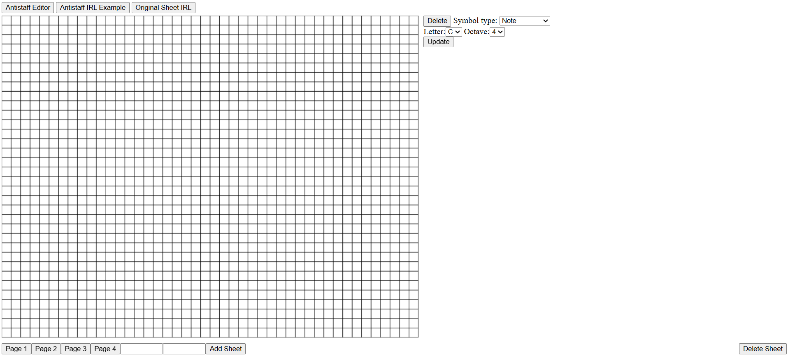

# Example


# Installation (Windows)
Open terminal in the desired folder for the program to be put in and run:
```
git clone https://github.com/DiabloSerpent/antistaff_notation_editor.git
```
Navigate into folder from terminal and run:
```
.\venv\Scripts\activate
```
```bash
pip install -r requirements.txt
```

# Run program from Terminal
(while venv is active)
```bash
uvicorn src.backend.main:app
```
